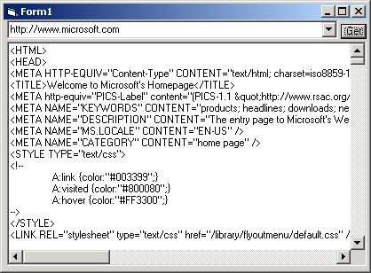

<div align="center">

## \_ Get webpage source through a simple api call


</div>

### Description

Nothing fancy about this, it simply retrieves the source of the url you specify. The best part about this code, is you don't need to add any controls to your code. you just drop in the module, and call one function

[some string]=GetURLSource("http://[some url]")

It's simple and lightweight, and with a little creativity, you could add features like daily news headlines, todays weather forecast, or stock prices to your projects.

If you'e got any questions, feel free to send me a message.
 
### More Info
 
url of web page

assumes you are connected to the internet.

html source of web page


<span>             |<span>
---                |---
**Submitted On**   |2001-06-26 11:30:12
**By**             |[Alan Toews](https://github.com/Planet-Source-Code/PSCIndex/blob/master/ByAuthor/alan-toews.md)
**Level**          |Beginner
**User Rating**    |4.9 (253 globes from 52 users)
**Compatibility**  |VB 5\.0, VB 6\.0, VBA MS Access, VBA MS Excel
**Category**       |[Internet/ HTML](https://github.com/Planet-Source-Code/PSCIndex/blob/master/ByCategory/internet-html__1-34.md)
**World**          |[Visual Basic](https://github.com/Planet-Source-Code/PSCIndex/blob/master/ByWorld/visual-basic.md)
**Archive File**   |[Get webpag217406262001\.zip](https://github.com/Planet-Source-Code/alan-toews-get-webpage-source-through-a-simple-api-call__1-24465/archive/master.zip)

### API Declarations

```
Public Declare Function InternetOpen
Lib "wininet.dll" Alias "InternetOpenA" (ByVal
sAgent As String, ByVal lAccessType As Long,
ByVal sProxyName As String, ByVal sProxyBypass As
String, ByVal lFlags As Long) As Long
Public Declare Function InternetOpenUrl _
Lib "wininet.dll" Alias "InternetOpenUrlA"(ByVal
hInternetSession As Long, ByVal sURL As String, _
ByVal sHeaders As String,ByVal lHeadersLength As _
Long, ByVal lFlags As Long, ByVal lContext As _
Long) As Long
Public Declare Function InternetReadFile _
Lib "wininet.dll" (ByVal hFile As Long, ByVal _
sBuffer As String,ByVal lNumBytesToRead As Long, _
lNumberOfBytesRead As Long) As Integer
Public Declare Function InternetCloseHandle _
Lib "wininet.dll" (ByVal hInet As Long) As Integer
```


